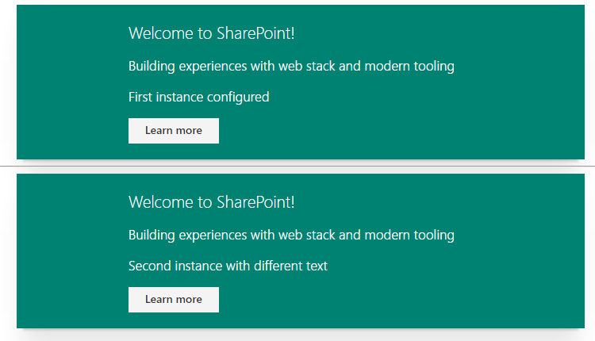

# Generic React app for modern web development

## Summary
Simple react app based on [web-library-build](https://github.com/Microsoft/web-library-build).



Targeted to demonstrates on how to use web stack and modern tooling without SharePoint Framework (SPFx). Can be used for example example in on-premises deployments where SharePoint Framework (SPFx) is not available.

SharePoint Framework is planned to be released to SharePoint 2016 during calendar year of 2017. SPFx is NOT planned to be released to SharePoint 2013 or SharePoint 2010.

This sample demonstrates how to start adapting modern web stack development practice in older SharePoint versions. This way you can start learning and using modern development practices and when you're moving to SharePoint 2016 or SharePoint Online, you'll get further benefits from th SharePoint Framework.

## Applies to

* SharePoint Online
* SharePoint 2016
* SharePoint 2013
* (SharePoint 2010)

## Prerequisites
You will need to have Node.js installed on your development box. 
You can for example follow the SPFx d

## Solution

Solution|Author(s)
--------|---------
react-generic-app | Chakkaradeep Chandran (Microsoft), Vesa Juvonen (Microsoft), Waldek Mastykarz (Rencore)

## Version history

Version|Date|Comments
-------|----|--------
1.0|December 23, 2016|Initial release

## Disclaimer
**THIS CODE IS PROVIDED *AS IS* WITHOUT WARRANTY OF ANY KIND, EITHER EXPRESS OR IMPLIED, INCLUDING ANY IMPLIED WARRANTIES OF FITNESS FOR A PARTICULAR PURPOSE, MERCHANTABILITY, OR NON-INFRINGEMENT.**

---

## How to use in development?

- Clone repo to your computer
- Move to sample folder
- Run 'npm install'
- Run 'gulp serve'

Add following to script editor web part in SharePoint 2016 or 2013. 

```javascript

<!-- Style -->
<link rel="stylesheet" href="https://appsforoffice.microsoft.com/fabric/fabric-core/4.0.0/fabric.min.css">
 
<!-- Client Side Web Part -->
<div class="webpart-script-example" data-description="Configuration entry for instance"></div>
 
<!-- Dependencies -->
<script src="http://localhost:4321/node_modules/react/dist/react.js"></script>
<script src="http://localhost:4321/node_modules/react-dom/dist/react-dom.js"></script>
 
<!-- Main -->
<script src="http://localhost:4321/dist/react-app.js"></script>

```

If used in context of SharePoint 2010, you'll need to use content editor web part and reference the needed script from a txt file, so that script tags are rendering properly.

> Notice. When you have gulp serve running, you can perform edits for example with Visual Studio Code to the files and you'll see the changes after page refresh in the context of SharePoint.

## How to deploy to production?
You would be deploying the needed JavaScript files to be hosted in some centralized location, for example SharePoint library accessed for everyone. Script referenced in the script editor part would be then updated to point to this location.

> Technically you'd only need to reference react and styling referenced once in the page. So if you are using multiple instances of the web part, you can reference JS and CSS files in one instance and keep the script editor entry only with the reference to app specific script.

